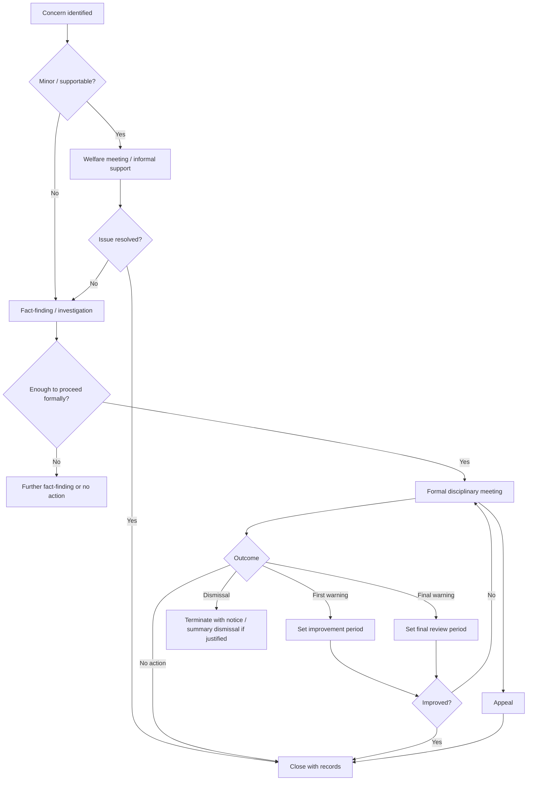

# Flowchart — disciplinary process

```mermaid
flowchart TD
  A[Concern identified] --> B{Minor / supportable?}
  B -- Yes --> C[Welfare meeting / informal support]
  B -- No --> D[Fact-finding / investigation]
  C --> E{Issue resolved?}
  E -- Yes --> Z[Close with records]
  E -- No --> D
  D --> F{Enough to proceed formally?}
  F -- No --> G[Further fact-finding or no action]
  F -- Yes --> H[Formal disciplinary meeting]
  H --> I{Outcome}
  I -- No action --> Z
  I -- First warning --> J[Set improvement period]
  I -- Final warning --> K[Set final review period]
  I -- Dismissal --> L[Terminate with notice / summary dismissal if justified]
  J --> M{Improved?}
  K --> M
  M -- Yes --> Z
  M -- No --> H
  H --> N[Appeal]
  N --> Z
```
